# Data analytics and prediction using Netezza Performance Server

In this code pattern, we will learn about how users and developers interested in leveraging the development and use of analytic algorithms to perform research or other business-related activities using Netezza Performance Server. Netezza a.k.a. Netezza or INZA, enables data mining tasks on large data sets using the computational power and parallelization mechanisms provided by the Netezza appliance. The parallel architecture of the Netezza database environment enables high-performance computation on large data sets, making it the ideal platform for largescale data mining applications.

Netezza has in-database Analytics packages for mining the spectrum of data set sizes. IBM Netezza In-Database Analytics is a data mining application that includes many of the key techniques and popular real-world algorithms used with data sets.

In this code pattern, we will load Jupyter notebook using IBM Cloud Pak for Data (CP4D) platform. The notebook has steps to connect to Netezza and use In-Database analytic functions to analyze the data and also run machine learning algorithms which allows you to predict and forecast data. In order to access analytical functions of Netezza, you should install `INZA` module into the Netezza server. All of the analytical functions are under `INZA` schema AND `NZA` database.

In this code pattern, we will be using energy price dataset and analyze the data using Jupyter Notebook using IBM Cloud Pak for Data (CP4D) platform. We will walk you through step by step on:

1. Analyzing data using Netezza In-Database analytic functions.
1. Creating machine learning models using Netezza In-Database machine learning algorithms.

# Flow

TBD


## Included components

* [Netezza Performance Server](https://www.ibm.com/products/netezza): IBM Netezza® Performance Server for IBM Cloud Pak® for Data is an advanced data warehouse and analytics platform available both on premises and on cloud.
* [IBM Cloud Pak for Data Platform](https://www.ibm.com/products/cloud-pak-for-data) : IBM Cloud Pak® for Data is a fully-integrated data and AI platform that modernizes how businesses collect, organize and analyze data to infuse AI throughout their organizations.
* [Jupyter Notebook](https://jupyter.org/): An open-source web application that allows you to create and share documents that contain live code, equations, visualizations and narrative text.

## Steps
1. [Create a new project in CP4D](#1-create-a-new-project-in-cp4d)
1. [Add connection to Netezza server](#2-add-connection-to-netezza-server)
1. [Upload data assets](#3-upload-data-assets)
1. [Load notebook to your project](#4-load-notebook-to-your-project)
1. [Install NZPY](#5-install-NZPY)
1. [Configure NPS connection in notebook](#6-configure-NPS-connection-in-notebook)
1. [Load data to Netezza](#7-load-data-to-netezza)
1. [Visualize energy price data](#8-visualize-energy-price-data)
1. [Analyze energy price data](#9-analyze-energy-price-data)
1. [Create machine learning model using timeseries algorithm](#10-create-machine-learning-model-using-timeseries-algorithm)

### 1. Create a new project in CP4D

* Log into IBM Cloud Pak for Data and create a new project, by selecting `Projects` from hamburger menu and clicking `New Project +`.

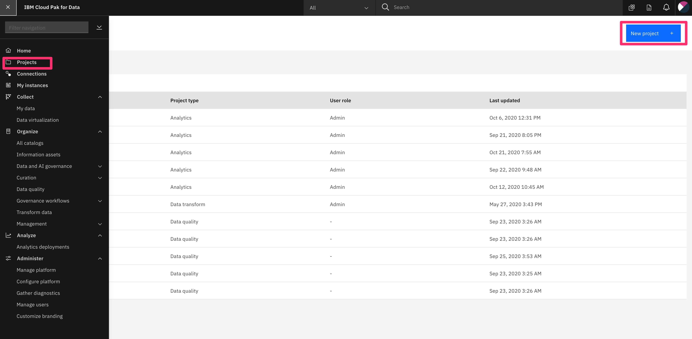

Then, choose `Analytics project`, and select `Create empty project`, provide the project `Name` and click `Create`.

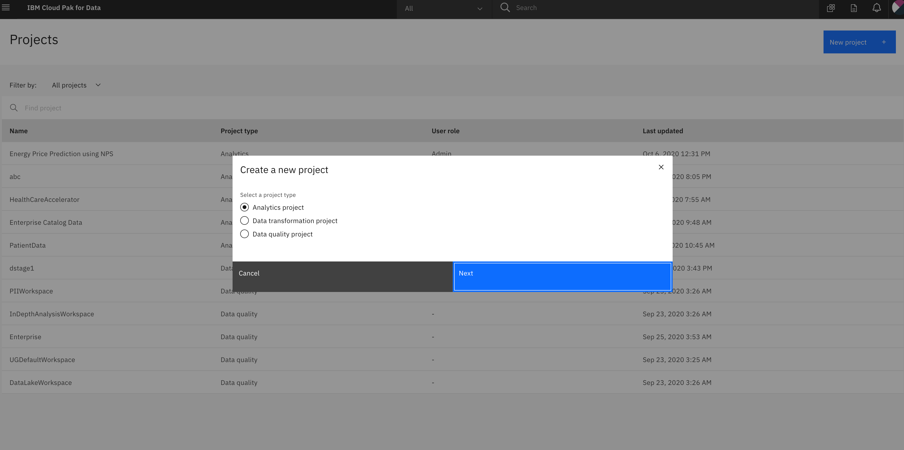

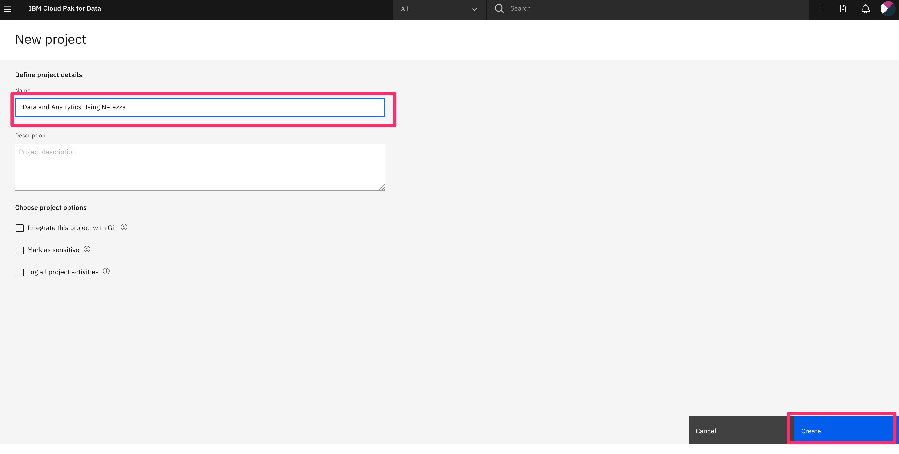

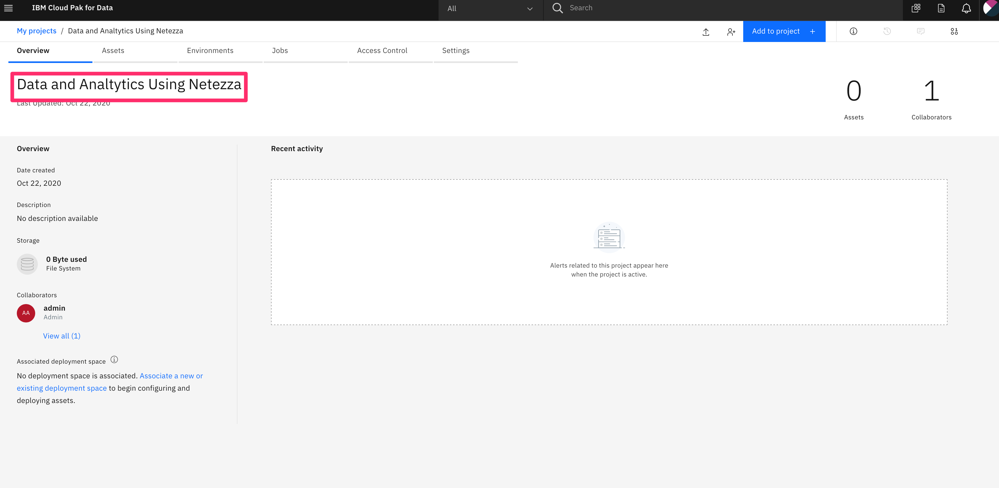


### 2. Add connection to Netezza server

There are two ways you can add connection to the notebook.  Use one of the ways to add connection to NPS.

#### Adding connection using CPD

* From the project page select, `Add to project +`, choose `Connection`

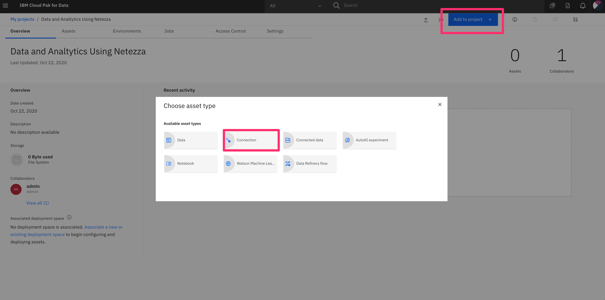

* In the next screen, choose `From Global` tab `NPS for pure analytics`

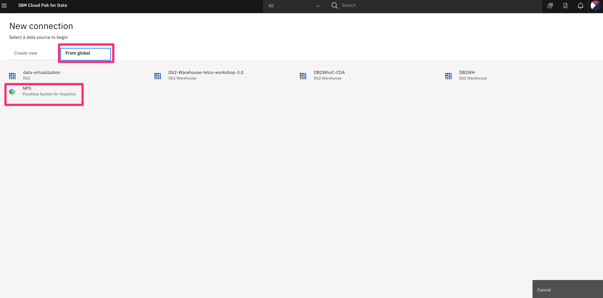

* Fill out the connection details, `Test the connection` and if it is successful, click `Create`.

> NOTE: for database you can use `system` for now. We will be creating our own database and using that in our notebook.

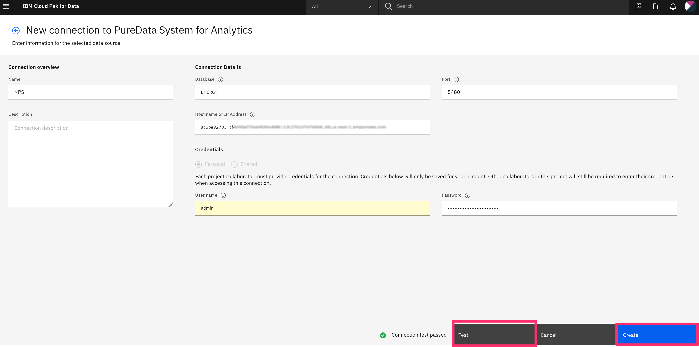

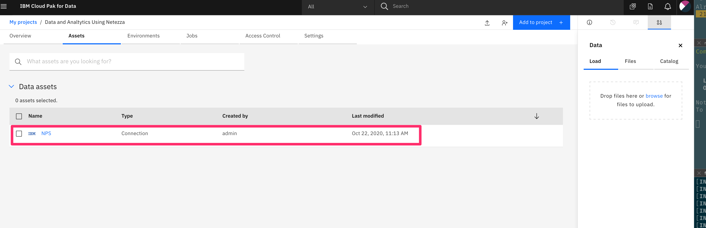

>NOTE: Save the name of the connection for later use.

### 3. Upload data assets

Upload `energy_price.csv` from the cloned repository folder by going to `doc/source/data`. In the project home page, on the `Assets` tab, click the data icon, and browse to upload the file. You will have to unzip the data locally first before you upload.

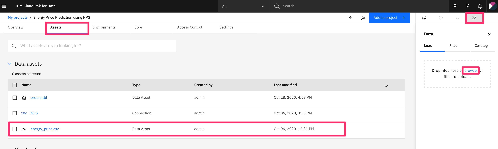

### 4. Load notebook to your project

* From the project page, click `Add to project +`, and select `notebook` from the options:

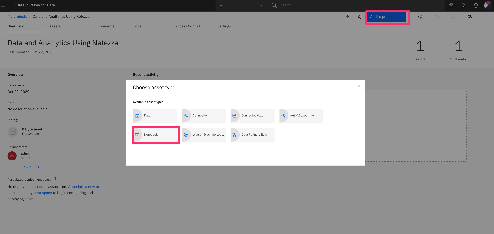

* Select `From URL` tab and fill in the name and provide the `Notebook URL` as below, and click `Create notebook`.

```bash
https://raw.github.com/
```

### 5. Install NZPY

Run the cell that contains `pip install nzpy` which is the only pre-requisite for this notebook. `nzpy` lets us connect to the server and allow us to run DDL and DML SQLs.

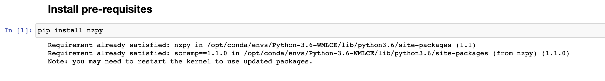

### 6. Configure NPS connection in notebook

* Open the notebook in edit mode, and in the cell with title `Connecting to the database`, provide the name of the connection that you created earlier in step 2.

* Run that cell and the cell below and make sure you get the 10 database names. This ensures that we have successfully connected to our remote NPS server.

OR

Add the connection detail directly into the notebook by replacing the values of the following in the connection cell.

```bash
# Setup connection and use the credentials from the connection. Replace the following values before you start

# from project_lib import Project
# project = Project.access()
# NPS_credentials = project.get_connection(name="NPS")

## OR

username="<username>"
password="<password>"
host="<hostname or ip>"
database="system"
```

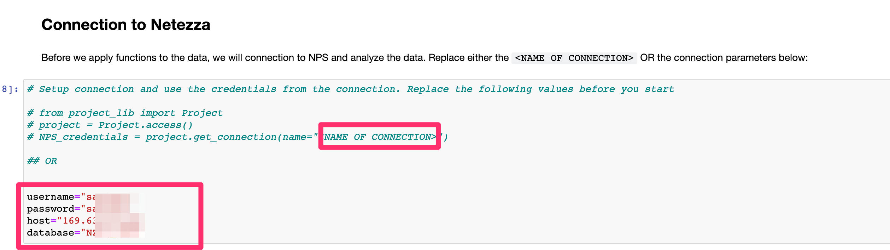

### 7. Load data to Netezza

We will be loading the `energy_price.csv` file to Netezza using `external table` feature of Netezza. First we create the table and load csv file directly to Netezza like below:

```python
## initialize cursor
cursor=con.cursor()
## drop table if exists
table='energy_price'
cursor.execute(f'drop table {table} if exists')

cursor.execute('''
CREATE TABLE nzpy_test..energy_price (
    temperature    REAL,
    pressure    REAL,
    humidity    REAL,
    wind_speed    REAL,
    precipitation    REAL,
    price    REAL,
    price_hour    TIMESTAMP
)
''')
print('Table energy price successfully created')
## Load the data to Netezza

with con.cursor() as cursor:
    cursor.execute('''
        insert into nzpy_test..energy_price
            select * from external '/project_data/data_asset/energy_price.csv'
                using (
                    delim ',' 
                    remotesource 'odbc'
                    )''')
    print(f"{cursor.rowcount} rows inserted")

```

### 8. Visualize energy price data

In this part of the notebook, we will be exploring the data, datatypes and correlation between different columns with `price`. You can run the cell on this part step by step. The overall graph group by dates is shown below:

```python
updDf.groupby('DATES').sum().plot.line().legend(loc='upper left',bbox_to_anchor=(1.05, 1))
```
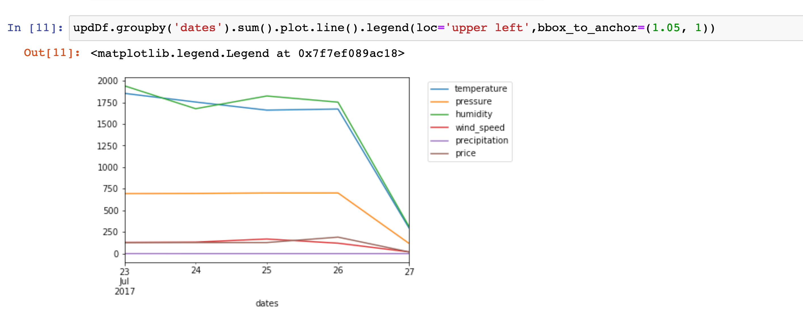

In the above graph,  you can see the correlation between temperature, pressure, humidity, wind speed, precipitation with price.

Similarly, you can see the correlation between individual columns (temperature, pressure, humidity, wind speed, precipitaion) with Price as well.

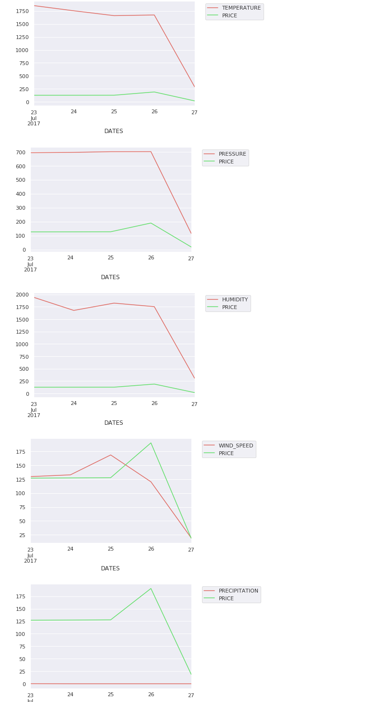


### 9. Analyze energy price data

In-database analytic functions such as `summary1000` and `cov` lets you analyze your data. It automatically give you statistical analysis of each columns. The `summary1000` function gives you statistics like distinct values, average, variance, standard deviation etc. as shown below

```sql
summaryDF = pd.read_sql("CALL nza..SUMMARY1000('intable=ENERGY_PRICE, outtable=PRICE_TEMP_ANALYSIS');", con)
summaryAnalysisDF = pd.read_sql('select * from PRICE_TEMP_ANALYSIS', con)
summaryAnalysisDF.head()
```

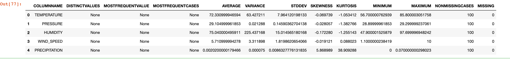

Also you can call `nza..COV` function to get the covariance. Below code show the relation between `temperature` and `price` column. 

```python
    # cursor.execute("drop table PRICE_TEMP_ANALYSIS if exists")
    pd.read_sql("CALL nza..DROP_TABLE('PRICE_TEMP_ANALYSIS')",con);

    # use the Covariance function, store results in PRICE_TEMP_ANALYSIS
    pd.read_sql("CALL nza..COV('intable=ENERGY_PRICE, incolumn=TEMPERATURE;PRICE,outtable=PRICE_TEMP_ANALYSIS');",con)
    # bring the results table into the notebook - or just query it directly in Netezza
    pd.read_sql('select * from PRICE_TEMP_ANALYSIS', con)
```

### 10. Create machine learning model using timeseries algorithm

* First we will cleanup the training data set. Since we are using time sereies algorithm, the timestamp column will have to converted to date format to represent each day and use the `row id` as the unique id.

```python
# clean up the analysis tables
pd.read_sql("CALL nza..DROP_TABLE('PRICE_TEMP_NEW')",con);
# the INZA functions usully need a unique ID for each row of data, we use the internal ROWID for this
cursor=con.cursor()
cursor.execute("create table PRICE_TEMP_NEW as select *,DATE(PRICE_HOUR) AS DAY,ROWID as ID from ENERGY_PRICE")
priceTempNewDf = pd.read_sql('select * from PRICE_TEMP_NEW limit 10', con)
```

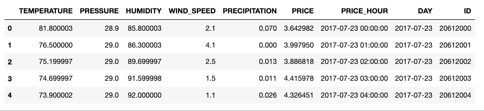

Now lets create the model using time series algorithm, by calling the `nza..timeseries` function:

```python
# drop model if it was already created. Initially you might want to comment this out
# and run as it throws error if if doesn't find the model
cursor.execute("CALL nza..DROP_MODEL('model=PRICE_TIME');")

# we now call a timeseries algorithm to create a model, the model name is PRICE_TIME
pd.read_sql("CALL nza..TIMESERIES('model=PRICE_TIME, intable=ADMIN.PRICE_TEMP_NEW, by=DAY, time=PRICE_HOUR, target=PRICE' );",con)

```

Once the query execution is completed,  you can check the `v_nza_models` table to see if the model has been created.

```python
# we can list our models here
pd.read_sql("select * from v_nza_models;",con=con)

```
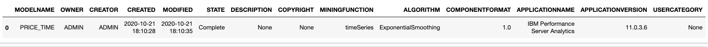


# License

This code pattern is licensed under the Apache Software License, Version 2.  Separate third party code objects invoked within this code pattern are licensed by their respective providers pursuant to their own separate licenses. Contributions are subject to the [Developer Certificate of Origin, Version 1.1 (DCO)](https://developercertificate.org/) and the [Apache Software License, Version 2](https://www.apache.org/licenses/LICENSE-2.0.txt).

[Apache Software License (ASL) FAQ](https://www.apache.org/foundation/license-faq.html#WhatDoesItMEAN)